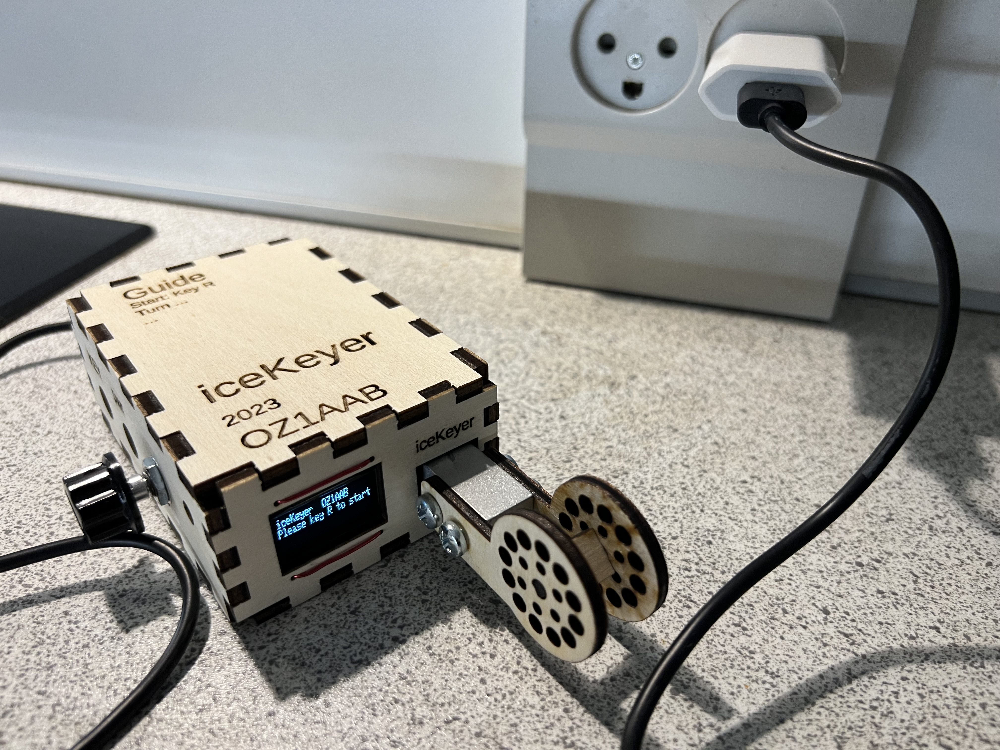

# iceKeyer, the no fuss keyer

## Features
- No moving elements
- Need pressure are automatically calculated, by reading how the usage is
- No adjustment
- No more bad contacts, no wetting problems
- No noise/click
- Room for magnets on bottom
- No Jambic, as only 1 paddle
- I do use my own [CWComfort](https://www.fihl.net/cw/) [older pictures](https://www.fihl.net/CWComfort/) 
  - where you can keep keying using your own speed, and transmit on a lower speed. 
  - Farnsworth spacing both on words and on single letters
- Easy access to memory entry/transmit

## The electronics
- ESP32 (Like [LOLIN S2 mini](https://www.aliexpress.com/item/1005004912486444.html))
- SSD1306 display
- Load cell weight element with [electronics HX711](https://www.aliexpress.com/item/1005005990833147.html) 
  - HX711 changed for 80 samplings/second
- Alternative, for an old style key, one can be made out of a single [body weight element](https://www.aliexpress.com/item/1005003760719720.html), when getting a new scale in the bathroom.

## Box laser cutting
I do export dxf files right out of OpenSCAD. 
And the text is exported in svg file 
